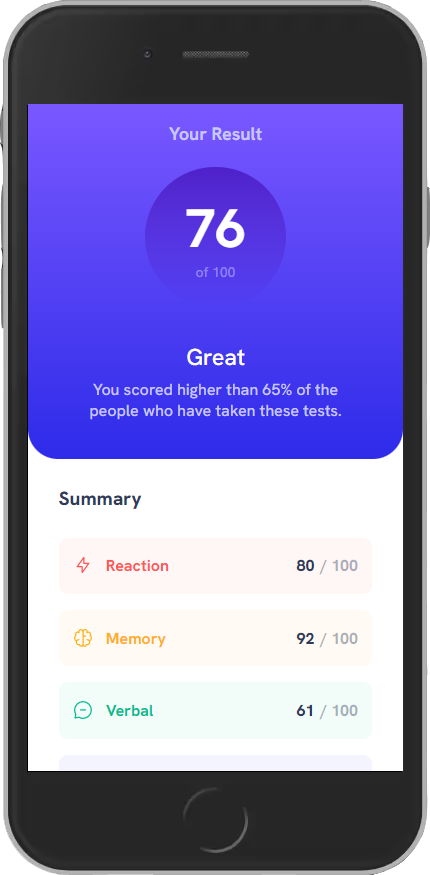
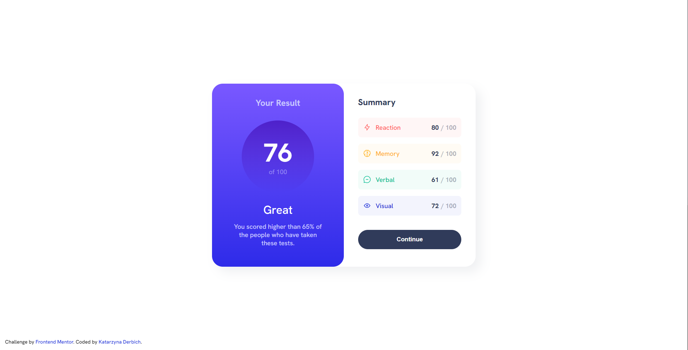

# Frontend Mentor - Results summary component solution

This is a solution to the [Results summary component challenge on Frontend Mentor](https://www.frontendmentor.io/challenges/results-summary-component-CE_K6s0maV). Frontend Mentor challenges help you improve your coding skills by building realistic projects.

## Table of contents

- [Overview](#overview)
  - [The challenge](#the-challenge)
  - [Screenshots](#screenshots)
  - [Links](#links)
- [My process](#my-process)
  - [Built with](#built-with)
  - [What I learned](#what-i-learned)
- [Author](#author)

## Overview

### The challenge

Users should be able to:

- View the optimal layout for the interface depending on their device's screen size
- See hover and focus states for all interactive elements on the page

### Screenshots

- Mobile Solution (375px width):

  

- Desktop Solution (1920px width):

  

### Links

- Solution URL: [GitHub Solution](https://github.com/belie369/frontend-mentor-result-summary-component)
- Live Site URL: [GitHub Live](https://belie369.github.io/frontend-mentor-result-summary-component/)

## My process

### Built with

- Semantic HTML5 markup
- SASS SCSS (with the appropriate architecture)
- BEM methodology
- Flexbox
- JavaScript
- JSON
- Gulp
- Mobile-first workflow

### What I learned

- How to design a file structure for a small project using Gulp and SCSS.
- I learned how to fetch data from a JSON file using JavaScript.
- I repeated my knowledge about the use of JavaScript.

## Author

- Website - [katarzynaderbich.pl](http://katarzynaderbich.pl/)
- Frontend Mentor - [@belie369](https://www.frontendmentor.io/profile/belie369)
- Twitter - [@belie369](https://www.twitter.com/belie369)
